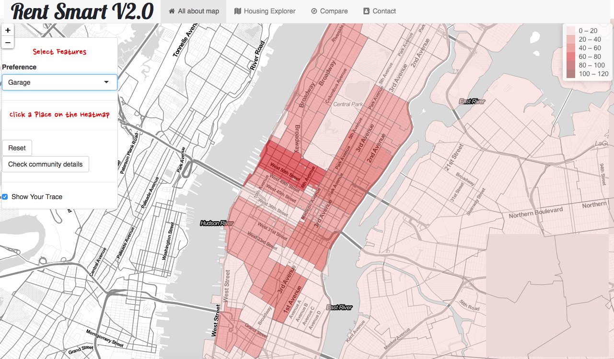
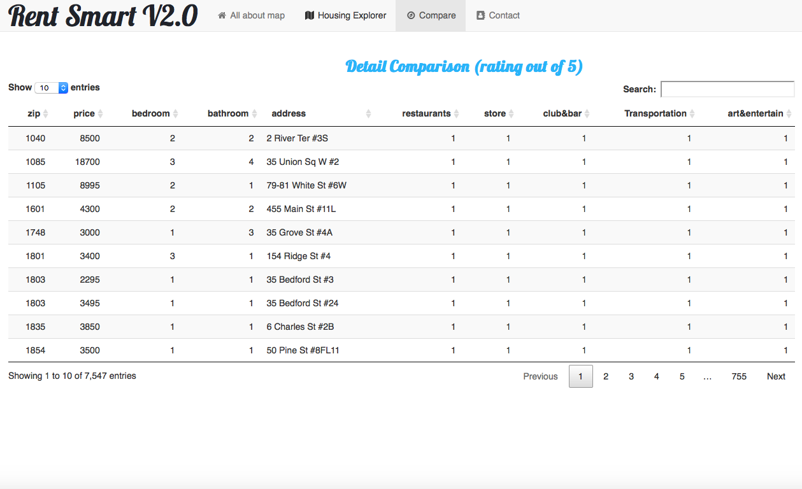

# Project 2: Shiny App Development Version 2.0

### [Project Description](doc/project2_desc.md)






## House Renting Version 2.0 
Term: Fall 2018

+ Team #3
+ **Projec title**: [Rent Smart V2.0](https://taburiss3525.shinyapps.io/HousingM/)
	+ Shilin Li SL4261
	+ Zhengyang Xu ZX2229
	+ Chenghao Yu CY2474
	+ Mingyu Yang MY2545
	+ Yang Yue YY2826
(Names are listed in alphabetical order of last names.)
+ **Project Summary**: 


We updated the app "Rent Smart" developed by previous students. The main purpose of the app is to recommend housing to renters. We take crime rate, restaurant numbers and type, transportation, numbers of market, and number of bathroom and bedroom into consideration.   

In the first panel, for a clearer visualization, we showcase a heat map for each of the factors including average price, numbers of market, crime rate, garage and transportation. We also add in a feature where one could select a neighborhood and be taken to the second panel where the data presented only includes properties in that specific neighborhood. We integerated informations of the previous "Dot Position" panel into the first and third panel. In the second housing recommendation panel, instead of recommending an area to rent, we add in data to recommend specific properties. Filters are changed to make recommendations on more relevant information. Once properties are selected on the second panel, a visualization for comparison between these properties are shown in the third compare panel. We includes dot details for restaurant, museum and theater in the second panel map. For the third panel, the previous app uses bar charts that are often too crowded and hard for non-professionals to look at. We here include basic informations in a table format that we believe are easier to understand. 

+ **Contribution Statement**: ([default](doc/a_note_on_contributions.md)) 
All members contributed equally to this project. Updated features and user interface are discussed with all group members presents. Each panel's contributors implemented and tested the code for server.R and Ui.R. Details are listed below:

Brainstorming: All Members  
Panel One - About Map: Chenghao Yu  
Panel Two - Housing Explorer : Shilin Li, Zhengyang Xu, Mingyu Yang  
Panel Three - Compare: Yang Yue  
Panel Four - Contact Us: Shilin Li  
Linking between Panel one and two: Chenghao Yu   
Linking between Panel two and three: Zhengyang Xu  
Read Me Information: Mingyu Yang   
(Names are listed in alphabetical order of last names.)

Following [suggestions](http://nicercode.github.io/blog/2013-04-05-projects/) by [RICH FITZJOHN](http://nicercode.github.io/about/#Team) (@richfitz). This folder is orgarnized as follows.

```
proj/
├── app/
├── lib/
├── data/
├── doc/
└── output/
```

Please see each subfolder for a README file.
